# Ingestion Service Architecture

> **Service Version:** 0.1.0  
> **Last Updated:** January 2026  
> **Part of:** CourseLLM Platform

---

## Table of Contents

1. [Overview](#overview)
2. [System Context](#system-context)
3. [High-Level Architecture](#high-level-architecture)
4. [Component Deep Dive](#component-deep-dive)
5. [API Reference](#api-reference)
6. [External API Integrations](#external-api-integrations)
7. [Data Flow](#data-flow)
8. [Module Reference](#module-reference)
9. [Configuration](#configuration)
10. [Deployment](#deployment)
11. [Monitoring & Debugging](#monitoring--debugging)

---

## Overview

The **Ingestion Service** is a FastAPI-based microservice responsible for transforming educational course materials into RAG-friendly (Retrieval-Augmented Generation) chunks. It is a critical component in the CourseLLM platform's content processing pipeline.

### What This Service Does

| Capability | Description |
|------------|-------------|
| **Markdown Chunking** | Splits markdown documents into semantically coherent chunks optimized for vector search |
| **LLM Preprocessing** | Optional normalization of messy input into clean, structured Markdown |
| **Embedding Generation** | Computes vector embeddings for each chunk via external embedding APIs |
| **Topic Extraction** | Extracts keywords and topics from chunks using |
| **Semantic Search** | similarity search over recently processed chunks |

### Key Technologies

- **Framework:** FastAPI (Python 3.11+)
- **Chunking Library:** [Chonkie](https://github.com/chonkie-ai/chonkie) - Markdown-aware recursive chunking
- **Embedding Provider:** OpenRouter API (default: `qwen/qwen3-embedding-8b`)
- **LLM Preprocessing:** OpenRouter API (default: `google/gemma-3-27b-it:free`)
- **Containerization:** Docker / Docker Compose

---

## System Context

The Ingestion Service operates within the larger **CourseLLM** educational platform ecosystem. Understanding its position in the overall architecture is essential.

### CourseLLM Platform Overview

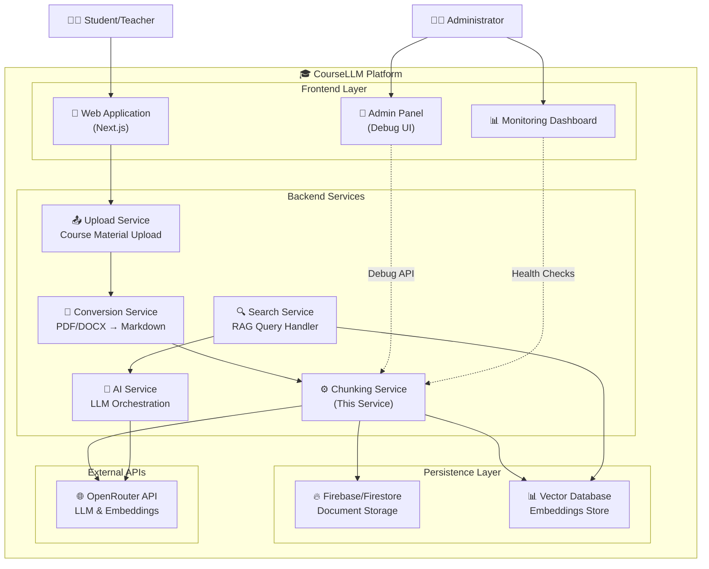

### Service Boundaries

| Upstream Services | This Service | Downstream Services |
|-------------------|--------------|---------------------|
| **Upload Service** - Receives raw course materials (PDF, DOCX, etc.) | **Chunking Service** - Chunks and embeds Markdown content | **Persistence Layer** - Stores chunks with embeddings |
| **Conversion Service** - Converts documents to Markdown format | | **Search Service** - Queries chunks for RAG |

---

## High-Level Architecture

### Internal Architecture Diagram

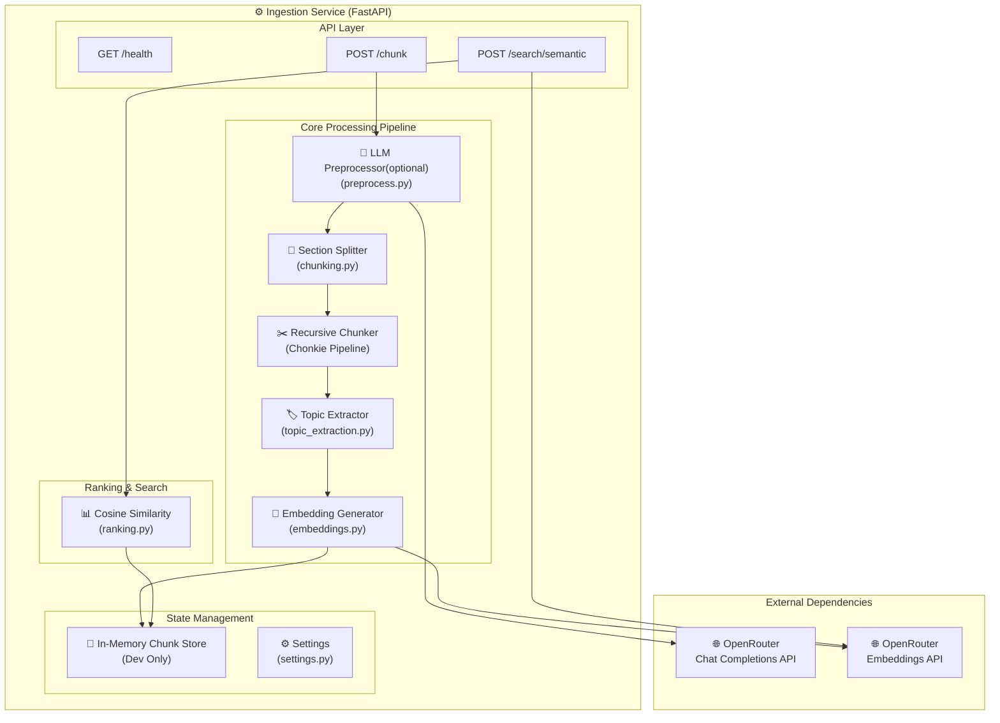

### Request Flow Summary

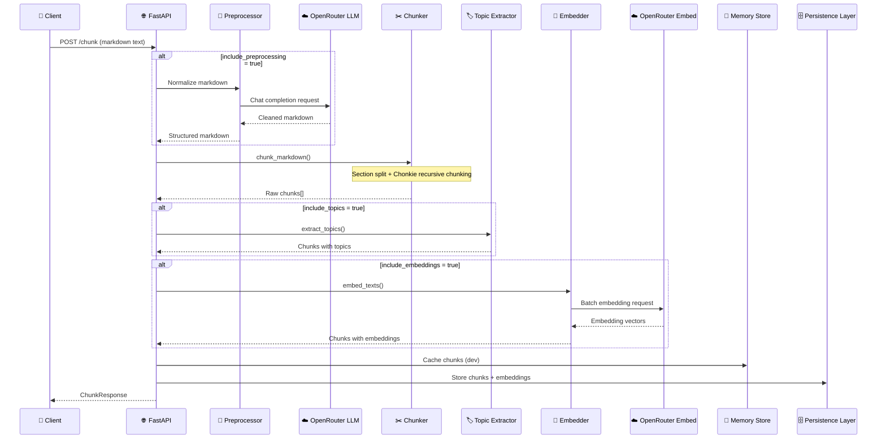

---

## Component Deep Dive

### 1. LLM Preprocessor (`preprocess.py`)

The preprocessor is an **optional** component that normalizes messy or unstructured input into clean, well-structured Markdown before chunking.

#### Purpose

- Convert informal text, slide notes, or mixed-format content into valid Markdown
- Improve semantic structure with proper heading hierarchy
- Remove noise (duplicate titles, page numbers, slide markers)
- Prepare content for optimal downstream chunking

#### Architecture

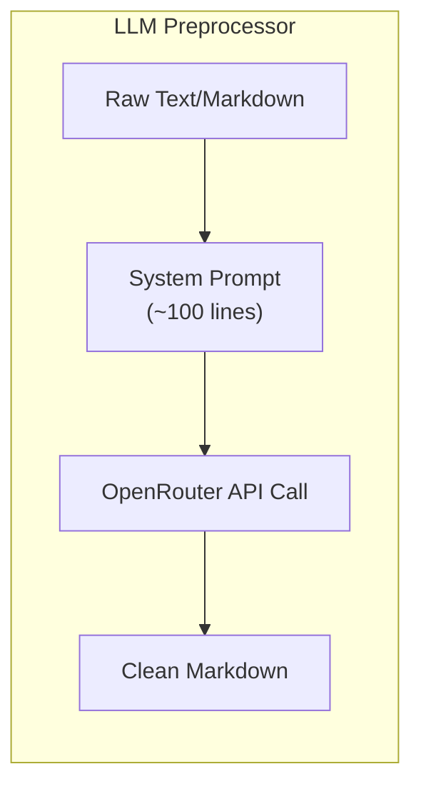

#### Key Implementation Details

| Aspect | Details |
|--------|---------|
| **Location** | [`app/preprocess.py`](app/preprocess.py) |
| **Class** | `OpenRouterPreprocessor` (dataclass) |
| **Method** | `preprocess_to_markdown(text: str) -> str` |
| **Default Model** | `google/gemma-3-27b-it:free` |
| **API Endpoint** | `https://openrouter.ai/api/v1/chat/completions` |

#### System Prompt Objectives

The system prompt instructs the LLM to:

1. **Preserve 100%** of original informational content
2. **Improve semantic structure** with proper Markdown headers
3. **Normalize formatting** (lists, tables, emphasis)
4. **Prepare for chunking** without introducing artificial boundaries

```python
# From preprocess.py - Key configuration
@dataclass(frozen=True)
class OpenRouterPreprocessor:
    api_key: str
    model: str
    timeout_s: float = 60.0
    base_url: str = "https://openrouter.ai/api/v1"
```

---

### 2. Markdown Chunker (`chunking.py`)

The core chunking engine that splits Markdown content into RAG-optimized segments.

#### Two-Stage Strategy

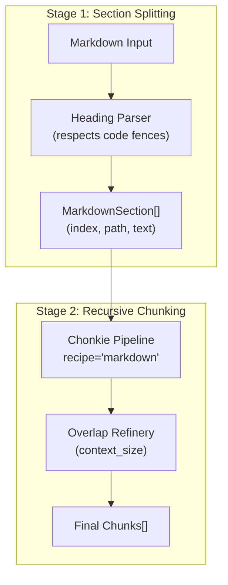

#### Key Implementation Details

| Aspect | Details |
|--------|---------|
| **Location** | [`app/chunking.py`](app/chunking.py) |
| **Main Function** | `chunk_markdown(markdown, chunk_size, overlap_size, ...)` |
| **Section Parser** | `_iter_markdown_sections(markdown)` - yields `MarkdownSection` |
| **Chunking Library** | Chonkie `Pipeline` with recursive strategy |

#### Section Splitting Logic

The section splitter handles:

- **Heading Detection:** Regex pattern `^(#{1,6})\s+(.*)\s*$`
- **Code Fence Awareness:** Tracks ``` and ~~~ markers to avoid splitting inside code blocks
- **Path Tracking:** Maintains hierarchical heading stack for section paths

```python
# From chunking.py
@dataclass(frozen=True)
class MarkdownSection:
    index: int          # Sequential section number
    path: list[str]     # Heading hierarchy, e.g., ["Chapter 1", "Section 1.1"]
    text: str           # Section content
```

#### Chonkie Pipeline Configuration

```python
# Markdown-aware recursive chunking
pipeline_markdown = Pipeline().chunk_with(
    "recursive",
    tokenizer=tokenizer,      # Default: "word"
    chunk_size=chunk_size,    # Default: 450 tokens
    recipe="markdown",        # Markdown-aware splitting
).refine_with(
    "overlap",
    context_size=overlap_size  # Default: 80 tokens
)
```

#### Output Structure

Each chunk includes:

```python
{
    "index": 0,              # Global chunk index
    "text": "...",           # Chunk content
    "token_count": 342,      # Token count from Chonkie
    "section_index": 2,      # Parent section index
    "section_path": "Ch1 > Intro"  # Heading hierarchy
}
```

---

### 3. Topic Extractor (`topic_extraction.py`)

A **deterministic heuristic-based** topic extractor that doesn't require external API calls.

#### Extraction Strategy

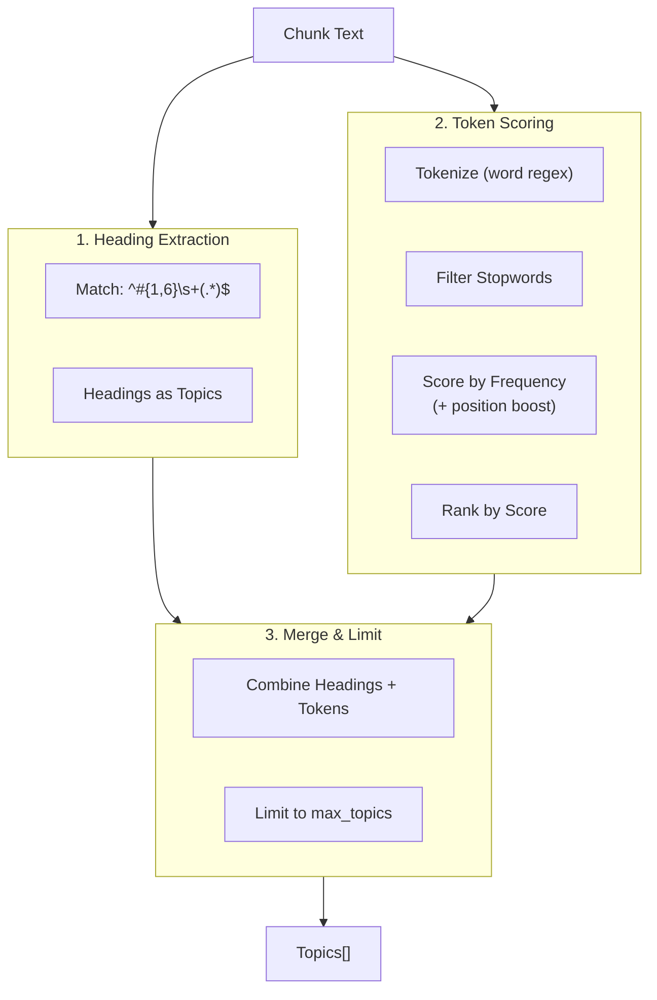

#### Key Implementation Details

| Aspect | Details |
|--------|---------|
| **Location** | [`app/topic_extraction.py`](app/topic_extraction.py) |
| **Main Function** | `extract_topics(text, model, max_topics)` |
| **Heuristic Function** | `heuristic_extract_topics(text, max_topics)` |
| **Default Max Topics** | 10 |

#### Scoring Algorithm

```python
# Position-weighted frequency scoring
scores[word] = scores.get(word, 0.0) + (1.0 / (1.0 + (i / 50.0)))
```

- Earlier words get higher scores
- Stopwords and digits are filtered
- Long identifiers (>40 chars) are de-emphasized

---

### 4. Embedding Generator (`embeddings.py`)

Generates vector embeddings for semantic similarity search.

#### Provider Architecture

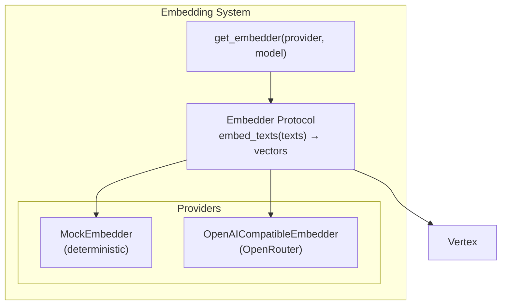

#### Key Implementation Details

| Aspect | Details |
|--------|---------|
| **Location** | [`app/embeddings.py`](app/embeddings.py) |
| **Protocol** | `Embedder` - defines `embed_texts(texts) -> list[list[float]]` |
| **Factory** | `get_embedder(provider, model)` |
| **Default Provider** | `mock` (for development) |
| **Production Provider** | `openrouter` with `qwen/qwen3-embedding-8b` |

#### Provider Details

| Provider | Class | API Endpoint | Auth |
|----------|-------|--------------|------|
| `mock` | `MockEmbedder` | None (local) | None |
| `openrouter` | `OpenAICompatibleEmbedder` | `https://openrouter.ai/api/v1/embeddings` | `OPENROUTER_API_KEY` |


### 5. Ranking System (`ranking.py`)

Provides similarity scoring for search functionality.

#### Capabilities

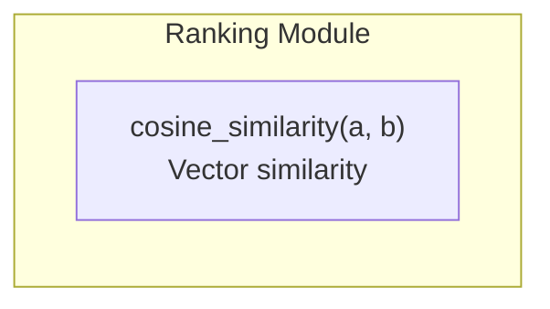

#### Key Functions

| Function | Purpose | Range |
|----------|---------|-------|
| `cosine_similarity(a, b)` | Compute vector similarity | [-1, 1] |


## API Reference

### Endpoint Overview

| Method | Path | Description | Reference |
|--------|------|-------------|-----------|
| `GET` | `/health` | Health check | [`main.py#L37-L39`](app/main.py#L37-L39) |
| `POST` | `/chunk` | Process and chunk markdown | [`main.py#L42-L131`](app/main.py#L42-L131) |
| `POST` | `/search/semantic` | Semantic similarity search | [`main.py#L138-L197`](app/main.py#L138-L197) |

---

### `GET /health`

Health check endpoint for monitoring and load balancer probes.

#### Response

```json
{
  "ok": true,
  "service": "ingestion",
  "version": "0.1.0"
}
```

---

### `POST /chunk`

The primary endpoint for processing markdown content into RAG-ready chunks.

#### Code Reference

Location: [`app/main.py`](app/main.py) lines 42-131

```python
@app.post("/chunk", response_model=ChunkResponse)
def chunk(req: ChunkRequest):
    # ... implementation
```

#### Request Schema

Defined in [`app/models.py`](app/models.py) as `ChunkRequest`:

| Field | Type | Required | Default | Description |
|-------|------|----------|---------|-------------|
| `text` | `string` | ✅ | - | Markdown text to chunk |
| `chunk_size` | `int` | ❌ | 450 | Target tokens per chunk (50-4000) |
| `overlap_size` | `int` | ❌ | 80 | Overlap tokens between chunks (0-1000) |
| `include_section_path` | `bool` | ❌ | `true` | Include heading hierarchy in output |
| `include_preprocessing` | `bool` | ❌ | `false` | Enable LLM markdown normalization |
| `preprocess_model` | `string` | ❌ | `google/gemma-3-27b-it:free` | LLM model for preprocessing |
| `include_topics` | `bool` | ❌ | `false` | Extract topics per chunk |
| `topic_model` | `string` | ❌ | - | Topic extraction model (unused, heuristic only) |
| `max_topics` | `int` | ❌ | 10 | Maximum topics per chunk (1-32) |
| `include_embeddings` | `bool` | ❌ | `false` | Generate embedding vectors |
| `embedding_provider` | `string` | ❌ | `mock` | Embedding provider (`mock`, `openrouter`, `openai`) |
| `embedding_model` | `string` | ❌ | `qwen/qwen3-embedding-8b` | Embedding model name |

#### Response Schema

Defined in [`app/models.py`](app/models.py) as `ChunkResponse`:

```json
{
  "chunk_count": 15,
  "chunks": [
    {
      "index": 0,
      "text": "# Introduction\n\nThis chapter covers...",
      "token_count": 342,
      "section_index": 0,
      "section_path": "Introduction",
      "embedding": [0.123, -0.456, ...],  // if include_embeddings=true
      "topics": ["introduction", "overview"],  // if include_topics=true
      "topic_source": "heuristic",
      "rank": null
    }
  ],
  "warnings": ["Preprocessing skipped..."]  // optional
}
```

#### Processing Pipeline

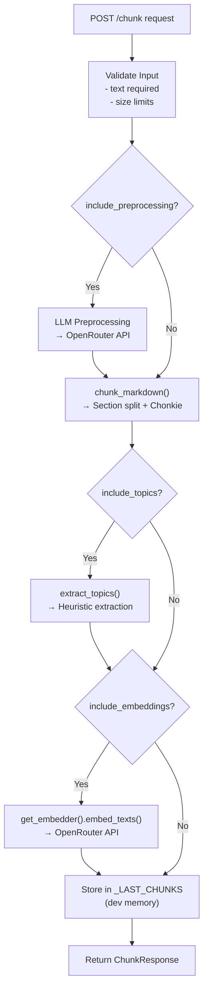

#### Error Responses

| Status | Condition | Detail |
|--------|-----------|--------|
| `400` | Empty text | `"text is required"` |
| `401` | Missing API key | `"Missing OPENROUTER_API_KEY"` |
| `413` | Text too large | `"text too large (max 400000 chars)"` |
| `413` | Too many chunks | `"too many chunks to embed (N > 256)"` |
| `500` | Embedding failure | `"Failed to generate embeddings: ..."` |

#### Example Request

```bash
curl -X POST http://localhost:8000/chunk \
  -H "Content-Type: application/json" \
  -d '{
    "text": "# Machine Learning\n\n## Introduction\n\nMachine learning is...",
    "chunk_size": 400,
    "overlap_size": 50,
    "include_topics": true,
    "max_topics": 8,
    "include_embeddings": true,
    "embedding_provider": "openrouter",
    "embedding_model": "qwen/qwen3-embedding-8b"
  }'
```

---

### `POST /search/semantic`

Development-only endpoint for semantic similarity search over the most recently chunked content.

#### Code Reference

Location: [`app/main.py`](app/main.py) lines 138-197

```python
@app.post("/search/semantic", response_model=SemanticSearchResponse)
def search_semantic(req: SemanticSearchRequest):
    """Search chunks by semantic similarity using embeddings."""
```

#### Request Schema

Defined in [`app/models.py`](app/models.py) as `SemanticSearchRequest`:

| Field | Type | Required | Default | Description |
|-------|------|----------|---------|-------------|
| `query` | `string` | ✅ | - | Natural language search query |
| `limit` | `int` | ❌ | 25 | Maximum results (1-200) |
| `min_similarity` | `float` | ❌ | `null` | Minimum similarity threshold (0.0-1.0) |

#### Response Schema

Defined in [`app/models.py`](app/models.py) as `SemanticSearchResponse`:

```json
{
  "total_results": 42,
  "chunks": [
    {
      "index": 5,
      "text": "Neural networks are...",
      "token_count": 287,
      "section_path": "ML > Neural Networks",
      "embedding": [...],
      "topics": ["neural networks", "deep learning"],
      "rank": 87.5  // Similarity score 0-100
    }
  ],
  "embedding_dim": 4096
}
```

#### Search Flow

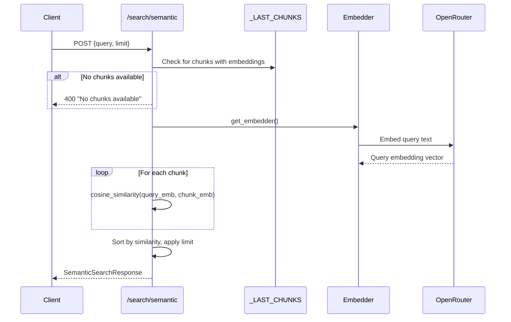

#### Example Request

```bash
curl -X POST http://localhost:8000/search/semantic \
  -H "Content-Type: application/json" \
  -d '{
    "query": "gradient descent optimization",
    "limit": 10,
    "min_similarity": 0.6
  }'
```

---

## External API Integrations

### OpenRouter API

The Ingestion Service integrates with [OpenRouter](https://openrouter.ai/) for both LLM preprocessing and embedding generation.

#### Integration Overview

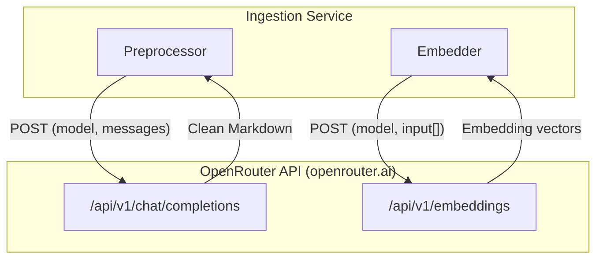

### Chat Completions API (Preprocessing)

Used by the LLM preprocessor to normalize markdown.

| Aspect | Details |
|--------|---------|
| **Endpoint** | `https://openrouter.ai/api/v1/chat/completions` |
| **Method** | `POST` |
| **Auth Header** | `Authorization: Bearer $OPENROUTER_API_KEY` |
| **Default Model** | `google/gemma-3-27b-it:free` |
| **Timeout** | 60 seconds |

#### Request Format

```json
{
  "model": "google/gemma-3-27b-it:free",
  "messages": [
    {"role": "system", "content": "You are a preprocessing component..."},
    {"role": "user", "content": "<raw markdown>"}
  ],
  "reasoning": {"effort": "none"}
}
```

#### Response Format

```json
{
  "choices": [
    {
      "message": {
        "content": "# Cleaned Markdown\n\n..."
      }
    }
  ]
}
```

### Embeddings API

Used by the embedding generator for vector computation.

| Aspect | Details |
|--------|---------|
| **Endpoint** | `https://openrouter.ai/api/v1/embeddings` |
| **Method** | `POST` |
| **Auth Header** | `Authorization: Bearer $OPENROUTER_API_KEY` |
| **Default Model** | `qwen/qwen3-embedding-8b` |
| **Timeout** | 30 seconds |

#### Request Format

```json
{
  "model": "qwen/qwen3-embedding-8b",
  "input": ["chunk 1 text", "chunk 2 text", "..."]
}
```

#### Response Format

```json
{
  "data": [
    {"embedding": [0.123, -0.456, ...]},
    {"embedding": [0.789, -0.012, ...]}
  ]
}
```

### Authentication

Both APIs use Bearer token authentication:

```python
headers = {
    "Authorization": f"Bearer {api_key}",
    "Content-Type": "application/json",
}
```

### Optional Headers

For OpenRouter, additional headers can be configured:

| Header | Environment Variable | Purpose |
|--------|---------------------|---------|
| `HTTP-Referer` | `OPENROUTER_HTTP_REFERER` | Analytics tracking |
| `X-Title` | `OPENROUTER_X_TITLE` | App identification |

---

## Data Flow

### Complete Ingestion Pipeline

This diagram shows the full journey of course material from upload to searchable chunks.

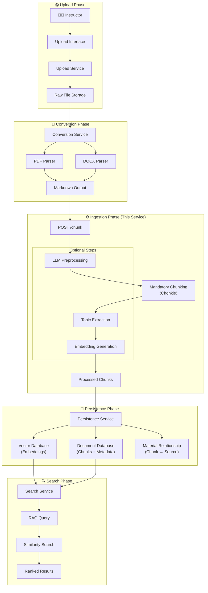

## Module Reference

### Directory Structure

```
services/ingestion/
├── app/
│   ├── __init__.py           # Package marker
│   ├── main.py               # FastAPI application & endpoints
│   ├── models.py             # Pydantic request/response models
│   ├── settings.py           # Configuration management
│   ├── chunking.py           # Markdown chunking logic
│   ├── preprocess.py         # LLM preprocessing
│   ├── embeddings.py         # Embedding generation
│   ├── topic_extraction.py   # Topic extraction
│   └── ranking.py            # Similarity & scoring functions
├── Dockerfile                # Container definition
├── docker-compose.yml        # Local development setup
├── requirements.txt          # Python dependencies
├── .env.example              # Environment template
├── README.md                 # Quick start guide
├── ARCHITECTURE.md           # This document
└── SETUP.md                  # Detailed setup instructions
```

### Module Dependency Graph

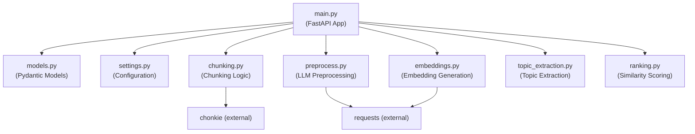


## Deployment

### Docker Deployment

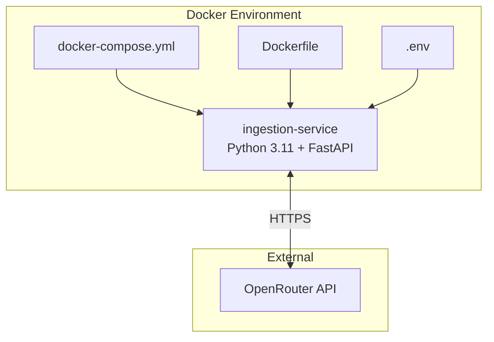
## Monitoring & Debugging

### Health Monitoring

The `/health` endpoint provides basic liveness checking:

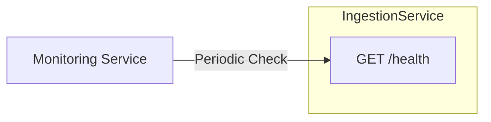

### Admin Panel Integration

The Admin Panel (part of the CourseLLM frontend) can interact with the Ingestion Service for debugging:

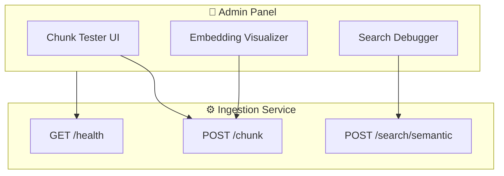

### Monitoring Dashboard Integration

The **Service Monitor** dashboard at `/debug/monitoring` provides real-time visibility into service health and system resources.

#### Available Endpoints

| Endpoint | Method | Description |
|----------|--------|-------------|
| `/health` | `GET` | Service health status (ok, service name, version) |
| `/metrics` | `GET` | System metrics (CPU, memory, disk usage) |

#### Metrics Response Format

```json
{
  "cpu": { "percent": 15.2 },
  "memory": { "used_mb": 512.3, "total_mb": 2048.0, "percent": 25.0 },
  "disk": { "used_gb": 10.5, "total_gb": 50.0, "percent": 21.0 }
}
```

#### Dashboard Features

| Feature | Description |
|---------|-------------|
| Service Health | Real-time health status with visual indicators |
| System Metrics | CPU, memory, and disk usage with progress bars |
| Auto-refresh | Automatic polling every 10 seconds |
| Response Time | Latency tracking for each health check |

#### Monitored Metrics

| Metric | Source | Purpose |
|--------|--------|---------|
| Service Health | `/health` | Uptime monitoring |
| CPU Usage | `/metrics` | Container resource tracking |
| Memory Usage | `/metrics` | Memory pressure detection |
| Disk Usage | `/metrics` | Storage monitoring |
| Request Latency | Application logs | Performance tracking |
| API Errors | Error responses | Issue detection |

### Debugging Tools

#### Swagger UI

Interactive API documentation at `http://localhost:8000/docs`:

- Test endpoints directly
- View request/response schemas
- Explore API structure

#### Development Search

The `/search/semantic` endpoint enables quick testing of embeddings without external storage:

```bash
# 1. Chunk content with embeddings
curl -X POST http://localhost:8000/chunk \
  -d '{"text": "...", "include_embeddings": true}'

# 2. Search the cached chunks
curl -X POST http://localhost:8000/search/semantic \
  -d '{"query": "your search query"}'
```

### Logging

The service uses Python's standard logging:

```python
import logging
logging.basicConfig(level=logging.INFO)
logger = logging.getLogger(__name__)
```

#### Log Levels

| Level | Use Case |
|-------|----------|
| `INFO` | Request handling, processing steps |
| `WARNING` | Fallbacks, non-critical issues |
| `ERROR` | API failures, processing errors |
| `DEBUG` | Detailed processing info |

---
