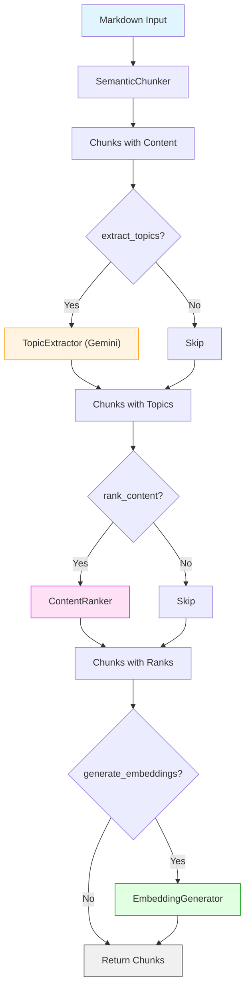

# Ingestion Service

This microservice handles the processing, chunking, and semantic analysis of educational content.

## Features

- **Semantic Chunking**: Intelligently groups related content using [Chonkie](https://github.com/chonkie-inc/chonkie).
- **Topic Extraction**: Uses Google Gemini (LLM) to extract key topics from every chunk.
- **Content Ranking**: Assigns a relevance score (0-100) based on semantic importance and structure.
- **Topic Search**: Search across processed chunks by topic with rank-based sorting.
- **Embeddings**: Generates vector embeddings using Sentence Transformers (local) or Vertex AI (cloud).
- **FastAPI**: High-performance Python API.

## Architecture & Pipeline



## API Endpoints

### 1. Chunking Endpoint
`POST /v1/chunk`

Parameters:
- `markdown` (required): The markdown text to chunk
- `strategy`: "semantic" (default), "recursive", or "token"
- `max_chunk_size`: Max tokens per chunk (default: 768)
- `overlap`: Overlap tokens between chunks (default: 0)
- `tokenizer`: Tokenizer model (default: "gpt2")
- `generate_embeddings`: Boolean to generate vectors
- `embedding_provider`: "sentence-transformers" or "vertex-ai"
- `embedding_model`: Specific model name
- `extract_topics`: Boolean to extract topics
- `rank_content`: Boolean to rank chunk relevance
- `document_title`: Context for ranking
- `similarity_threshold`: Semantic sensitivity 0-1 (Semantic only)
- `min_sentences_per_chunk`: Min sentences msg grouping (Semantic only)

**Request:**
```json
{
  "markdown": "# Machine Learning\n\nIntroduction...",
  "strategy": "semantic",
  "max_chunk_size": 768,
  "extract_topics": true,
  "rank_content": true,
  "document_title": "ML Basics",
  "generate_embeddings": true
}
```

**Response:**
```json
{
  "chunks": [
    {
      "index": 0,
      "content": "...",
      "token_count": 150,
      "topics": ["machine learning", "artificial intelligence"],
      "rank": 95.5,
      "metadata": {
        "topic_source": "gemini"
      },
      "embedding": [...]
    }
  ]
}
```

### 2. Topic Search Endpoint
`POST /v1/search/topics` (Development only - in-memory)

**Request:**
```json
{
  "topics": ["neural networks", "deep learning"],
  "min_rank": 50,
  "limit": 10
}
```

## Configuration

Required environment variables in `.env` (or `.env.local` in root):

### Core
- `GOOGLE_GENAI_API_KEY`: Your Gemini API Key from [Google AI Studio](https://aistudio.google.com/app/apikey). **Required for topic extraction.** (Can also be set as `GOOGLE_API_KEY`).

### Firebase Emulators (Development)
- `FIRESTORE_EMULATOR_HOST=host.docker.internal:8080`
- `FIREBASE_STORAGE_EMULATOR_HOST=host.docker.internal:9199`

### Vertex AI (Optional - for production embeddings)
- `GOOGLE_CLOUD_PROJECT`: GCP Project ID
- `GOOGLE_CLOUD_LOCATION`: e.g. `us-central1`
- `GOOGLE_GENAI_USE_VERTEXAI`: `True`

## Running locally

### With Docker (Recommended)
This method handles all dependencies automatically.

```bash
# From project root
pnpm docker:ingestion
```

### With Python (Direct)
Requires Python 3.11+.

```bash
cd services/ingestion
pip install -r requirements.txt
uvicorn app.main:app --reload --port 8000
```

## Testing

Run the included test suite:

```bash
cd services/ingestion
pytest
```
