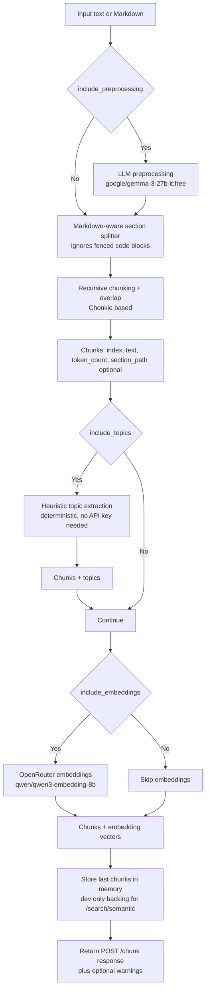

# Ingestion Service (FastAPI)

The ingestion service turns markdown into RAG-friendly chunks and can optionally add:

- LLM preprocessing to normalize messy input into clean Markdown (OpenRouter Gemma 3)
- embeddings (OpenRouter qwen3-embedding-8b)
- per-chunk topics (deterministic heuristic extractor)
- dev-only semantic search over the most recent chunking run

## Architecture & pipeline



## Run locally

Docker (recommended):

```bash
cd services/ingestion
docker compose up --build
```

Local Python (requires Python 3.11+):

```bash
cd services/ingestion
pip install -r requirements.txt
uvicorn app.main:app --reload --port 8000
```

## GitHub Codespaces

When running in GitHub Codespaces:

1. **Use `.env` files** (not shell exports) — Docker Compose reads directly from the `.env` file. Shell exports are not reliably passed to containers.
2. **Set port 8000 to Public** in the Ports panel for CORS to work correctly.

## API

- `GET /health`
- `POST /chunk`
- `POST /search/semantic` (development only; semantic similarity search using embeddings)

Swagger UI: http://localhost:8000/docs

### `POST /chunk`

Request fields of interest:

- `text` (markdown)
- `chunk_size`, `overlap_size` (set `overlap_size: 0` to disable overlap)
- `include_section_path`
- `include_preprocessing` (+ optional `preprocess_model`)
- `include_embeddings` (+ `embedding_provider`, `embedding_model`)
- `include_topics` (+ `max_topics`)

Example (topics + embeddings):

```bash
curl -X POST http://localhost:8000/chunk \
  -H "Content-Type: application/json" \
  -d '{
    "text": "# PRD\n\nThis PRD covers objectives and success metrics.",
    "include_topics": true,
    "max_topics": 8,
    "include_embeddings": true,
    "embedding_provider": "openrouter",
    "embedding_model": "qwen/qwen3-embedding-8b"
  }'
```

Example (preprocess messy input into clean Markdown before chunking):

```bash
curl -X POST http://localhost:8000/chunk \
  -H "Content-Type: application/json" \
  -d '{
    "text": "Lecture 3 - intro\n\nSLIDE 1: ...",
    "include_preprocessing": true,
    "preprocess_model": "google/gemma-3-27b-it:free"
  }'
```

Response:

- `chunks[]` with `text`, `token_count`, optional `section_path`
- optional `topics` + `topic_source`
- optional `embedding`
- optional response-level `warnings` (e.g., when topic extraction falls back)

### `POST /search/semantic`

Semantic similarity search using embeddings. Requires that you called `POST /chunk` first with `include_embeddings=true`.

```bash
curl -X POST http://localhost:8000/search/semantic \
  -H "Content-Type: application/json" \
  -d '{
    "query": "machine learning optimization",
    "min_similarity": 0.5,
    "limit": 25
  }'
```

The response includes chunks ranked by cosine similarity (scaled to 0-100), plus `embedding_dim` metadata.

## Configuration

Docker Compose reads environment variables from `services/ingestion/.env` automatically.
Create it from the template:

- copy [services/ingestion/.env.example](services/ingestion/.env.example) → `services/ingestion/.env`

### Core

- `CORS_ALLOW_ORIGINS` (default: `*` to allow all origins)
- `CHUNK_SIZE` (default: `450`)
- `OVERLAP_SIZE` (default: `80`)
- `TOKENIZER` (default: `word`)
- `MAX_INPUT_CHARS` (default: `400000`)

### Embeddings

- `EMBEDDING_PROVIDER` = `openrouter` (default), `mock`
- `OPENROUTER_API_KEY` (required for embeddings)
- `OPENROUTER_EMBED_MODEL` (default: `qwen/qwen3-embedding-8b`)
- `MAX_EMBED_CHUNKS` (default: `256`)

### Preprocessing (OpenRouter)

- `OPENROUTER_API_KEY` is required when `include_preprocessing=true` (or when `PREPROCESS_ENABLED=true`)
- `PREPROCESS_ENABLED` (default: `false`)
- `PREPROCESS_MODEL` (default: `google/gemma-3-27b-it:free`)
- `PREPROCESS_TIMEOUT_S` (default: `60`)
- `PREPROCESS_MAX_INPUT_CHARS` (default: `40000`)

- The preprocessor requests `reasoning.effort="none"` (when supported) to keep preprocessing fast.

### Topics

Topics are extracted using a fast deterministic heuristic. No API key is required.

- `TOPIC_MAX_TOPICS` (default: `10`) – maximum topics per chunk

## Dependencies

| Package | Version | Description |
|---------|---------|-------------|
| `fastapi` | 0.115.6 | Web framework |
| `uvicorn[standard]` | 0.32.1 | ASGI server |
| `pydantic` | 2.10.3 | Data validation |
| `python-dotenv` | 1.0.1 | Environment variable loading |
| `chonkie` | 1.4.2 | Markdown-aware chunking library |
| `requests` | 2.32.3 | HTTP client for OpenRouter API calls |

**Python version:** 3.11+
